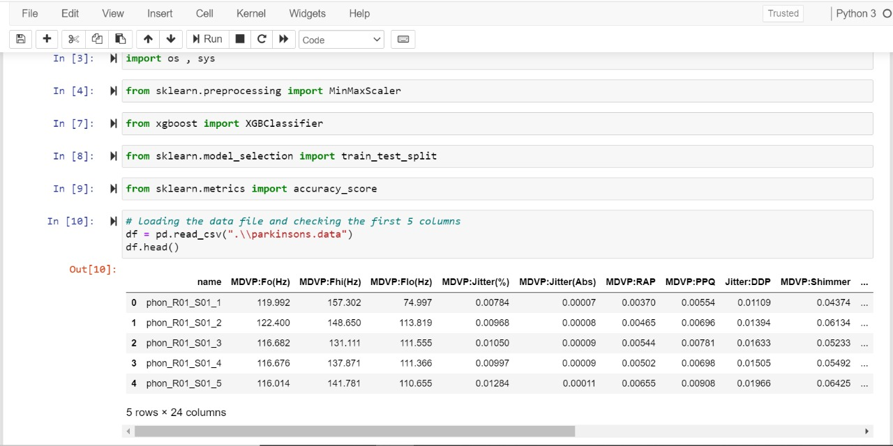
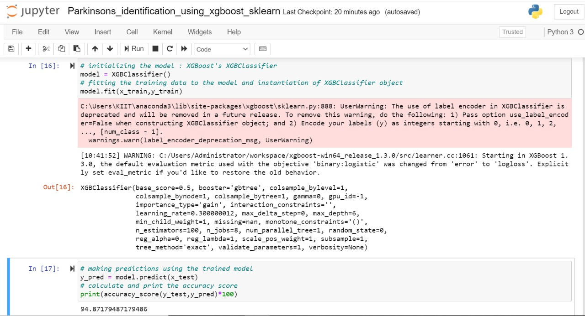

# Parkinson's Detection Using XGBoost and SkLearn
A machine learning project which aims at accurately predicting the occurence of Parkinsons disease based on the parkinsons.data dataset.
# Parkinson's
Parkinson's disease (PD), or simply Parkinson's is a long-term degenerative disorder of the central nervous system that mainly affects the motor system. The symptoms usually emerge slowly and, as the disease worsens, non-motor symptoms become more common.The most obvious early symptoms are tremor, rigidity, slowness of movement, and difficulty with walking.Cognitive and behavioral problems may also occur with depression, anxiety, and apathy occurring in many people with PD.Parkinson's disease dementia becomes common in the advanced stages of the disease.

Read more at : https://en.wikipedia.org/wiki/Parkinson%27s_disease

 

### Trying to Improve Accuracy ... Current Best = 94.87 %

 

